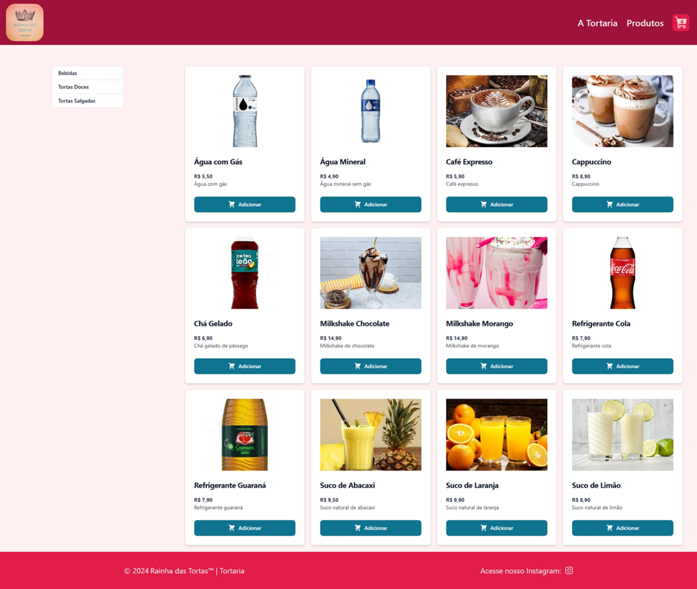

# 🍰 Rainha das Tortas

Aplicação full stack para **catálogo e venda de tortas doces, tortas salgadas e bebidas**, com interface web moderna e API REST desenvolvida em Java.

O projeto simula um pequeno negócio real, permitindo visualizar produtos, filtrar por categorias, adicionar itens ao carrinho e enviar pedidos diretamente via WhatsApp.

---

## 🧩 Visão Geral do Projeto

Este repositório contém **dois módulos principais**:

- **Frontend**: interface web para clientes
- **Backend**: API REST para gerenciamento de produtos e categorias

---

## 🖥️ Demonstração

### Tela inicial do sistema
Exibe todas as tortas e bebidas cadastradas, com preço, descrição e disponibilidade.



---

## ⚙️ Tecnologias Utilizadas

### Frontend
- ⚛️ React  
- 🟦 TypeScript  
- ⚡ Vite  
- 🎨 TailwindCSS  
- 💠 Flowbite React  
- 🔄 Axios  

### Backend
- ☕ Java 21  
- 🍃 Spring Boot 3.x  
- 📦 Maven  
- 🗄 MySQL  

---

## 🚀 Pré-requisitospara executar o Projeto

- Node.js 18+
- Java 21
- Maven
- MySQL (ou banco configurado no backend)

📘 **Documentação completa do backend:**  
[`rainhadastortas-backend/README.md`](./rainhadastortas-backend/README.md)

📘 **Documentação completa do frontend:**  
[`rainhadastortas-frontend/README.md`](./rainhadastortas-frontend/README.md)

---
## 🔗 Comunicação entre Frontend e Backend

O frontend consome a API REST do backend por meio da variável de ambiente:

```env
VITE_API_URL=http://localhost:8080
```

Certifique-se de que o backend esteja em execução antes de iniciar o frontend.

Além disso, o sistema permite o envio de pedidos diretamente para o WhatsApp da empresa, utilizando links formatados automaticamente.

---

## 📌 Funcionalidades do Sistema

- Listagem de produtos
- Filtro por categorias
- Visualização de detalhes do produto
- Carrinho de compras
- Controle de disponibilidade
- Envio de pedidos via WhatsApp
- API REST com CRUD completo de produtos e categorias

---

## 📄 Licença

Este projeto está sob a licença **MIT**.  
Consulte o arquivo [LICENSE](LICENSE) para mais detalhes.

---